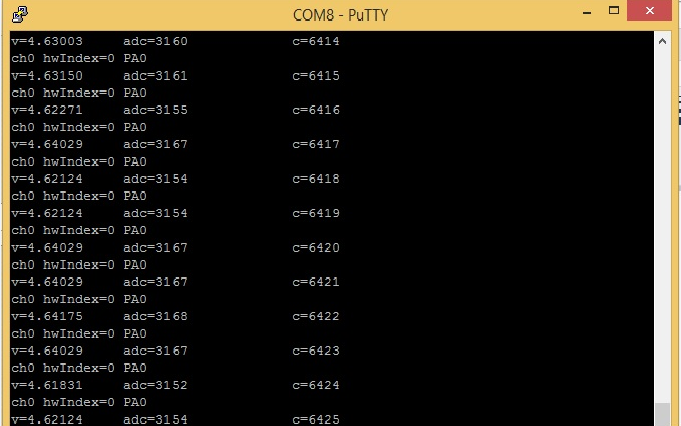

rusEfi firmware has a **I/O hardware testing mode** feature - this comes handy if you've just soldered some I/O board like Frankenso.

In order to activate I/O testing board you need to ground pin PB0. (You can confirm the current pin associated with this feature using `showconfig` command.)

Once PB0 is ground, you need to reset rusEfi. 
Currently dev console is not supported - in I/O testing mode you need to connect to the firmware using some terminal application like putty or hyperterminal. (TODO: add dev console support, for now you need to use putty)

Same as with normal mode, console uses micro USB port for the data flow by default.

The rest is self-explanatory - the firmware would be blinking output pins one by one, you can move to the next pin using 'n' command till you tell all the pins you wanted to test.

This is still ugly as hell, but much better then nothing.

